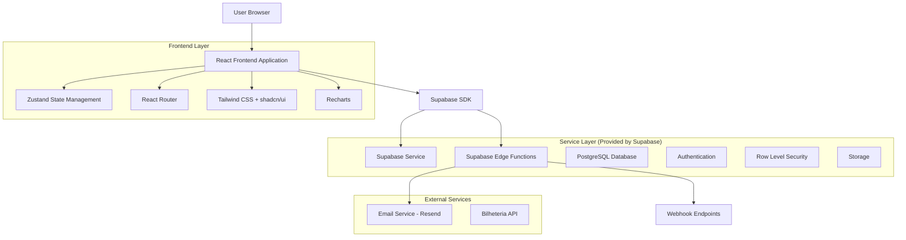
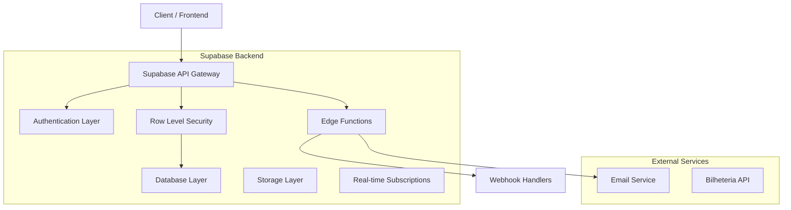
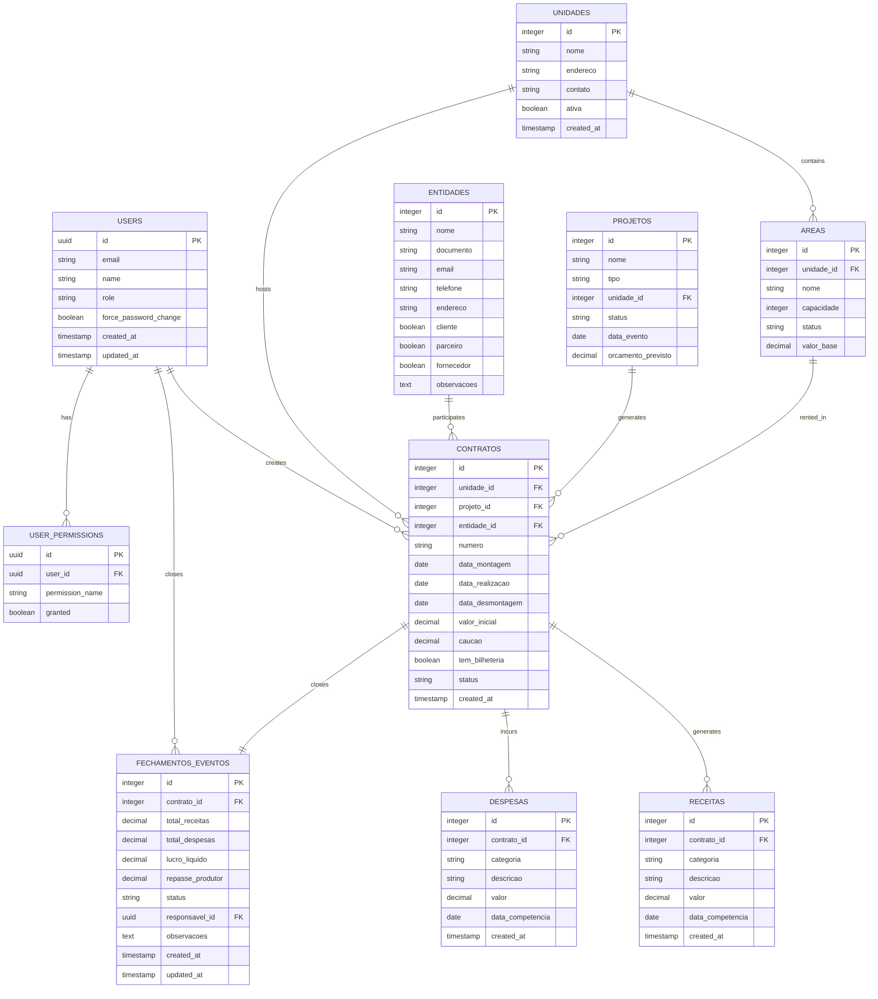

# Sistema de Gestão de Eventos - Arquitetura Técnica

## 1. Architecture design



## 2. Technology Description

* Frontend: React\@18 + TypeScript + Vite + TailwindCSS\@3 + shadcn/ui

* Backend: Supabase (Auth + Database + Storage + Edge Functions)

* State Management: Zustand

* Charts: Recharts

* UI Components: shadcn/ui + Lucide React icons

* Email Service: Supabase Edge Functions + Resend

* PDF Generation: jsPDF + react-csv

* Authentication: Supabase Auth with RLS policies

## 3. Route definitions

| Route                       | Purpose                                               |
| --------------------------- | ----------------------------------------------------- |
| /                           | Redirect to /dashboard or /login based on auth status |
| /login                      | Login page with Supabase Auth integration             |
| /dashboard                  | Main dashboard with KPIs, charts and overview         |
| /contratos                  | Contract management - list, create, edit, view        |
| /contratos/novo             | Create new contract form                              |
| /contratos/:id              | View/edit specific contract                           |
| /contratos/:id/documentos   | Contract documents management                         |
| /unidades                   | Units and rental areas management                     |
| /unidades/nova              | Create new unit form                                  |
| /unidades/:id/areas         | Manage areas for specific unit                        |
| /entidades                  | Entities management (clients, partners, suppliers)    |
| /entidades/nova             | Create new entity form                                |
| /entidades/:id              | View/edit specific entity                             |
| /projetos                   | Projects (events) management                          |
| /projetos/novo              | Create new project form                               |
| /projetos/:id               | View/edit specific project                            |
| /bilheteria                 | Ticketing management and reports                      |
| /bilheteria/canais          | Sales channels configuration                          |
| /bilheteria/relatorios      | Ticketing reports and analytics                       |
| /financeiro/receitas        | Revenue management                                    |
| /financeiro/despesas        | Expenses management                                   |
| /financeiro/fechamentos     | Event closures management                             |
| /financeiro/fechamentos/:id | View specific event closure                           |
| /configuracoes              | System settings and configuration                     |
| /configuracoes/usuarios     | User management                                       |
| /configuracoes/grupos       | Permission groups management                          |
| /configuracoes/sistema      | System parameters                                     |
| /configuracoes/integracoes  | External integrations setup                           |

## 4. API definitions

### 4.1 Core API

**Authentication**

```
POST /auth/v1/token
```

Request:

| Param Name | Param Type | isRequired | Description        |
| ---------- | ---------- | ---------- | ------------------ |
| email      | string     | true       | User email address |
| password   | string     | true       | User password      |

Response:

| Param Name     | Param Type | Description       |
| -------------- | ---------- | ----------------- |
| access\_token  | string     | JWT access token  |
| refresh\_token | string     | JWT refresh token |
| user           | object     | User profile data |

**Contract Management**

```
GET /rest/v1/contratos
POST /rest/v1/contratos
PUT /rest/v1/contratos?id=eq.{id}
DELETE /rest/v1/contratos?id=eq.{id}
```

**Financial Closure**

```
POST /functions/v1/fechar-evento
```

Request:

| Param Name      | Param Type | isRequired | Description          |
| --------------- | ---------- | ---------- | -------------------- |
| contrato\_id    | integer    | true       | Contract ID to close |
| total\_receitas | decimal    | true       | Total revenues       |
| total\_despesas | decimal    | true       | Total expenses       |
| observacoes     | string     | false      | Additional notes     |

**Email Validation Webhook**

```
POST /functions/v1/validar-repasse
```

Request:

| Param Name     | Param Type | isRequired | Description            |
| -------------- | ---------- | ---------- | ---------------------- |
| fechamento\_id | integer    | true       | Closure ID             |
| acao           | string     | true       | 'aprovar' or 'revisar' |
| token          | string     | true       | Validation token       |

## 5. Server architecture diagram



## 6. Data model

### 6.1 Data model definition



### 6.2 Data Definition Language

**Users and Permissions**

```sql
-- Users table (extends auth.users)
CREATE TABLE user_profiles (
    id UUID PRIMARY KEY REFERENCES auth.users(id) ON DELETE CASCADE,
    name VARCHAR(100) NOT NULL,
    role VARCHAR(20) DEFAULT 'user' CHECK (role IN ('admin', 'manager', 'user', 'producer')),
    force_password_change BOOLEAN DEFAULT true,
    created_at TIMESTAMP WITH TIME ZONE DEFAULT NOW(),
    updated_at TIMESTAMP WITH TIME ZONE DEFAULT NOW()
);

-- User permissions
CREATE TABLE user_permissions (
    id UUID PRIMARY KEY DEFAULT gen_random_uuid(),
    user_id UUID NOT NULL REFERENCES auth.users(id) ON DELETE CASCADE,
    permission_name VARCHAR(50) NOT NULL,
    granted BOOLEAN DEFAULT false,
    created_at TIMESTAMP WITH TIME ZONE DEFAULT NOW()
);

-- Permission groups
CREATE TABLE permission_groups (
    id INTEGER GENERATED BY DEFAULT AS IDENTITY PRIMARY KEY,
    name VARCHAR(50) NOT NULL UNIQUE,
    description TEXT,
    permissions JSONB NOT NULL DEFAULT '[]'::jsonb
);
```

**Core Business Tables**

```sql
-- Units table
CREATE TABLE unidades (
    id INTEGER GENERATED BY DEFAULT AS IDENTITY PRIMARY KEY,
    nome VARCHAR(100) NOT NULL,
    endereco TEXT,
    contato VARCHAR(100),
    ativa BOOLEAN DEFAULT true,
    created_at TIMESTAMP WITH TIME ZONE DEFAULT NOW(),
    updated_at TIMESTAMP WITH TIME ZONE DEFAULT NOW()
);

-- Areas table
CREATE TABLE areas (
    id INTEGER GENERATED BY DEFAULT AS IDENTITY PRIMARY KEY,
    unidade_id INTEGER NOT NULL REFERENCES unidades(id) ON DELETE CASCADE,
    nome VARCHAR(100) NOT NULL,
    capacidade INTEGER,
    status VARCHAR(20) DEFAULT 'disponivel' CHECK (status IN ('disponivel', 'reservada', 'ocupada')),
    valor_base DECIMAL(12,2),
    created_at TIMESTAMP WITH TIME ZONE DEFAULT NOW()
);

-- Entities table
CREATE TABLE entidades (
    id INTEGER GENERATED BY DEFAULT AS IDENTITY PRIMARY KEY,
    nome VARCHAR(200) NOT NULL,
    documento VARCHAR(20),
    email VARCHAR(100),
    telefone VARCHAR(20),
    endereco TEXT,
    cliente BOOLEAN DEFAULT false,
    parceiro BOOLEAN DEFAULT false,
    fornecedor BOOLEAN DEFAULT false,
    observacoes TEXT,
    created_at TIMESTAMP WITH TIME ZONE DEFAULT NOW(),
    updated_at TIMESTAMP WITH TIME ZONE DEFAULT NOW()
);

-- Projects table
CREATE TABLE projetos (
    id INTEGER GENERATED BY DEFAULT AS IDENTITY PRIMARY KEY,
    nome VARCHAR(200) NOT NULL,
    tipo VARCHAR(50),
    unidade_id INTEGER REFERENCES unidades(id),
    status VARCHAR(20) DEFAULT 'planejamento' CHECK (status IN ('planejamento', 'aprovado', 'em_andamento', 'concluido', 'cancelado')),
    data_evento DATE,
    orcamento_previsto DECIMAL(12,2),
    created_at TIMESTAMP WITH TIME ZONE DEFAULT NOW(),
    updated_at TIMESTAMP WITH TIME ZONE DEFAULT NOW()
);

-- Contracts table
CREATE TABLE contratos (
    id INTEGER GENERATED BY DEFAULT AS IDENTITY PRIMARY KEY,
    unidade_id INTEGER NOT NULL REFERENCES unidades(id),
    projeto_id INTEGER REFERENCES projetos(id),
    entidade_id INTEGER NOT NULL REFERENCES entidades(id),
    numero VARCHAR(50) UNIQUE NOT NULL,
    data_montagem DATE,
    data_realizacao DATE NOT NULL,
    data_desmontagem DATE,
    valor_inicial DECIMAL(12,2) NOT NULL,
    caucao DECIMAL(12,2),
    tem_bilheteria BOOLEAN DEFAULT false,
    status VARCHAR(20) DEFAULT 'ativo' CHECK (status IN ('ativo', 'concluido', 'cancelado')),
    created_at TIMESTAMP WITH TIME ZONE DEFAULT NOW(),
    updated_at TIMESTAMP WITH TIME ZONE DEFAULT NOW()
);
```

**Financial Tables**

```sql
-- Revenue categories
CREATE TABLE categorias_receitas (
    id INTEGER GENERATED BY DEFAULT AS IDENTITY PRIMARY KEY,
    nome VARCHAR(100) NOT NULL UNIQUE,
    descricao TEXT
);

-- Expense categories
CREATE TABLE categorias_despesas (
    id INTEGER GENERATED BY DEFAULT AS IDENTITY PRIMARY KEY,
    nome VARCHAR(100) NOT NULL UNIQUE,
    descricao TEXT
);

-- Revenues table
CREATE TABLE receitas (
    id INTEGER GENERATED BY DEFAULT AS IDENTITY PRIMARY KEY,
    contrato_id INTEGER NOT NULL REFERENCES contratos(id) ON DELETE CASCADE,
    categoria_id INTEGER REFERENCES categorias_receitas(id),
    descricao VARCHAR(200) NOT NULL,
    valor DECIMAL(12,2) NOT NULL,
    data_competencia DATE NOT NULL,
    created_at TIMESTAMP WITH TIME ZONE DEFAULT NOW(),
    updated_at TIMESTAMP WITH TIME ZONE DEFAULT NOW()
);

-- Expenses table
CREATE TABLE despesas (
    id INTEGER GENERATED BY DEFAULT AS IDENTITY PRIMARY KEY,
    contrato_id INTEGER NOT NULL REFERENCES contratos(id) ON DELETE CASCADE,
    categoria_id INTEGER REFERENCES categorias_despesas(id),
    descricao VARCHAR(200) NOT NULL,
    valor DECIMAL(12,2) NOT NULL,
    data_competencia DATE NOT NULL,
    created_at TIMESTAMP WITH TIME ZONE DEFAULT NOW(),
    updated_at TIMESTAMP WITH TIME ZONE DEFAULT NOW()
);

-- Event closures table
CREATE TABLE fechamentos_eventos (
    id INTEGER GENERATED BY DEFAULT AS IDENTITY PRIMARY KEY,
    contrato_id INTEGER NOT NULL REFERENCES contratos(id),
    total_receitas DECIMAL(12,2) NOT NULL,
    total_despesas DECIMAL(12,2) NOT NULL,
    lucro_liquido DECIMAL(12,2) NOT NULL,
    repasse_produtor DECIMAL(12,2),
    status VARCHAR(30) DEFAULT 'pendente_validacao' CHECK (status IN ('pendente_validacao', 'validado_pelo_produtor', 'revisao_solicitada', 'enviado')),
    responsavel_id UUID REFERENCES auth.users(id),
    observacoes TEXT,
    created_at TIMESTAMP WITH TIME ZONE DEFAULT NOW(),
    updated_at TIMESTAMP WITH TIME ZONE DEFAULT NOW()
);
```

**Indexes and Initial Data**

```sql
-- Create indexes
CREATE INDEX idx_contratos_unidade_id ON contratos(unidade_id);
CREATE INDEX idx_contratos_projeto_id ON contratos(projeto_id);
CREATE INDEX idx_contratos_entidade_id ON contratos(entidade_id);
CREATE INDEX idx_receitas_contrato_id ON receitas(contrato_id);
CREATE INDEX idx_despesas_contrato_id ON despesas(contrato_id);
CREATE INDEX idx_fechamentos_contrato_id ON fechamentos_eventos(contrato_id);
CREATE INDEX idx_fechamentos_status ON fechamentos_eventos(status);

-- Row Level Security Policies
ALTER TABLE user_profiles ENABLE ROW LEVEL SECURITY;
ALTER TABLE contratos ENABLE ROW LEVEL SECURITY;
ALTER TABLE receitas ENABLE ROW LEVEL SECURITY;
ALTER TABLE despesas ENABLE ROW LEVEL SECURITY;
ALTER TABLE fechamentos_eventos ENABLE ROW LEVEL SECURITY;

-- Basic access policies
CREATE POLICY "Users can view own profile" ON user_profiles FOR SELECT USING (auth.uid() = id);
CREATE POLICY "Authenticated users can view contracts" ON contratos FOR SELECT TO authenticated USING (true);
CREATE POLICY "Authenticated users can manage financial data" ON receitas FOR ALL TO authenticated USING (true);
CREATE POLICY "Authenticated users can manage financial data" ON despesas FOR ALL TO authenticated USING (true);

-- Grant permissions
GRANT SELECT ON unidades TO anon;
GRANT SELECT ON areas TO anon;
GRANT ALL PRIVILEGES ON ALL TABLES IN SCHEMA public TO authenticated;

-- Initial data
INSERT INTO categorias_receitas (nome, descricao) VALUES 
('Locação', 'Receita de locação de espaços'),
('Bilheteria', 'Receita de venda de ingressos'),
('Patrocínio', 'Receitas de patrocinadores'),
('Outras', 'Outras receitas diversas');

INSERT INTO categorias_despesas (nome, descricao) VALUES 
('Pessoal', 'Despesas com pessoal e terceiros'),
('Material', 'Despesas com materiais e equipamentos'),
('Marketing', 'Despesas com marketing e divulgação'),
('Infraestrutura', 'Despesas com infraestrutura e logística'),
('Outras', 'Outras despesas diversas');
```

