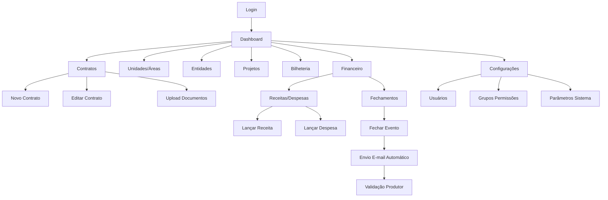

# Sistema de Gestão de Eventos Corporativo e Financeiro - PRD

## 1. Product Overview

Sistema integrado de gestão de eventos corporativo e financeiro para múltiplas empresas do grupo, centralizando contratos, bilheteria, unidades e resultados financeiros em uma plataforma única.

O sistema resolve a necessidade de controle financeiro detalhado de eventos, automatização de processos de fechamento e validação, além de fornecer visibilidade completa sobre performance e ROI dos eventos realizados.

Destinado a gestores de eventos, equipes financeiras e produtores, oferecendo controle granular de permissões e workflows automatizados para validação de repasses.

## 2. Core Features

### 2.1 User Roles

| Role | Registration Method | Core Permissions |
|------|---------------------|------------------|
| Administrador | Criação manual pelo sistema | Acesso total, criação de usuários, configuração de grupos e permissões |
| Gestor Financeiro | Convite por administrador | Acesso a módulos financeiros, fechamento de eventos, relatórios |
| Gestor de Contratos | Convite por administrador | CRUD de contratos, unidades, entidades, projetos |
| Produtor/Parceiro | Convite por administrador | Visualização de eventos próprios, validação de repasses |
| Operador | Convite por administrador | Acesso limitado conforme permissões individuais |

### 2.2 Feature Module

Nosso sistema de gestão de eventos consiste nas seguintes páginas principais:

1. **Dashboard**: KPIs de faturamento, gráficos por tipo de evento e unidade, status de contratos ativos
2. **Contratos**: CRUD completo, associação com áreas, upload de documentos, histórico de alterações
3. **Unidades e Áreas**: Cadastro de empresas/unidades e suas áreas locáveis com controle de disponibilidade
4. **Entidades**: Gestão de clientes, parceiros e fornecedores com múltiplas funções
5. **Projetos (Eventos)**: Registro de eventos vinculados a contratos com orçamento e status
6. **Bilheteria**: Controle de canais de venda, taxas, indicadores de público e relatórios
7. **Financeiro - Receitas/Despesas**: Lançamentos financeiros vinculados a contratos com categorização
8. **Financeiro - Fechamentos**: Módulo de fechamento de eventos com workflow de validação por e-mail
9. **Configurações**: Gestão de usuários, grupos, permissões e parâmetros do sistema
10. **Login/Recuperação**: Autenticação segura com alteração obrigatória de senha padrão

### 2.3 Page Details

| Page Name | Module Name | Feature description |
|-----------|-------------|---------------------|
| Dashboard | KPIs Gerais | Exibir faturamento total, margem de lucro, público acumulado por período selecionável |
| Dashboard | Gráficos Analíticos | Visualizar performance por tipo de evento, unidade e comparativos temporais usando Recharts |
| Dashboard | Status Contratos | Listar contratos ativos, faturamento acumulado, ROI e alertas de vencimento |
| Contratos | CRUD Contratos | Criar, editar, visualizar e excluir contratos com campos: unidade, projeto, número, evento, datas, valores, caução |
| Contratos | Associação Áreas | Vincular contratos a áreas locadas com validação de disponibilidade |
| Contratos | Gestão Documentos | Upload, visualização e download de contratos, anexos e checklists |
| Contratos | Histórico Alterações | Registrar e exibir log de modificações com usuário, data e campos alterados |
| Unidades e Áreas | CRUD Unidades | Cadastrar empresas/unidades com informações básicas e configurações |
| Unidades e Áreas | Gestão Áreas | Gerenciar áreas locáveis com nome, capacidade e status (disponível/reservada/ocupada) |
| Entidades | CRUD Entidades | Cadastrar clientes, parceiros e fornecedores com múltiplas funções via checkboxes |
| Entidades | Dados Completos | Gerenciar nome, CNPJ/CPF, contatos, e-mail, endereço e observações |
| Projetos | CRUD Projetos | Registrar eventos com nome, tipo, unidade, status, data e orçamento previsto |
| Projetos | Vinculação Contratos | Associar projetos a contratos existentes com validação de dados |
| Bilheteria | Canais Venda | Configurar e monitorar diferentes canais com taxas de conveniência específicas |
| Bilheteria | Indicadores Público | Controlar ingressos vendidos/lidos, cortesias emitidas/lidas, público total |
| Bilheteria | Relatórios Exportação | Gerar e exportar relatórios em PDF/CSV com gráficos comparativos |
| Financeiro Receitas/Despesas | Lançamentos Financeiros | Registrar receitas e despesas vinculadas a contratos com categorização |
| Financeiro Receitas/Despesas | Apuração Competência | Visualizar consolidado por competência, unidade, tipo de evento e projeto |
| Financeiro Receitas/Despesas | Cálculo Automático | Processar comissões, rateios e repasses a parceiros automaticamente |
| Financeiro Fechamentos | Fechamento Evento | Executar fechamento financeiro com cálculo de totais e lucro líquido |
| Financeiro Fechamentos | Workflow E-mail | Enviar automaticamente resumo para produtor com botões de aprovação/revisão |
| Financeiro Fechamentos | Listagem Status | Exibir todos os fechamentos com filtros por unidade, período, produtor e status |
| Configurações | Gestão Usuários | Criar usuários, definir grupos de permissões e configurar acessos individuais |
| Configurações | Parâmetros Sistema | Configurar moeda, formatos de data, alertas e integrações externas |
| Configurações | Webhooks SMTP | Configurar integração com API de bilheteria e serviços de e-mail |
| Login | Autenticação | Realizar login via Supabase Auth com validação de credenciais |
| Login | Recuperação Senha | Enviar e-mail de recuperação com link seguro para redefinição |
| Login | Alteração Obrigatória | Forçar alteração da senha padrão (123456) no primeiro acesso |

## 3. Core Process

### Fluxo Principal do Administrador
O administrador acessa o sistema, cria usuários e define grupos de permissões. Cadastra unidades, áreas e entidades base. Configura parâmetros do sistema e integrações externas.

### Fluxo do Gestor de Contratos
O gestor cria novos contratos associando unidades, projetos e entidades. Faz upload de documentos e acompanha o histórico de alterações. Vincula áreas locadas e configura se há bilheteria associada.

### Fluxo Financeiro Completo
Após a realização do evento, são lançadas todas as receitas e despesas no sistema. O gestor financeiro executa o fechamento do evento, que calcula automaticamente totais, lucro líquido e repasse ao produtor. O sistema envia e-mail automático para o produtor com resumo financeiro e botões de aprovação. O produtor valida ou solicita revisão, atualizando o status automaticamente via webhook.

### Fluxo do Produtor/Parceiro
O produtor recebe e-mail com resumo financeiro do evento e valor de repasse. Pode aprovar o repasse ou solicitar revisão diretamente pelo e-mail. Acessa o sistema para visualizar detalhes dos seus eventos e histórico de repasses.

## 4. User Interface Design

### 4.1 Design Style

- **Cores Primárias**: Azul corporativo (#1e40af), Verde sucesso (#059669), Vermelho alerta (#dc2626)
- **Cores Secundárias**: Cinza neutro (#6b7280), Branco (#ffffff), Cinza claro (#f9fafb)
- **Estilo de Botões**: Rounded corners (8px), sombra sutil, estados hover/active bem definidos
- **Tipografia**: Inter como fonte principal, tamanhos 14px (corpo), 16px (títulos seção), 24px (títulos página)
- **Layout**: Sidebar fixa à esquerda, header superior, conteúdo principal com cards e tabelas responsivas
- **Ícones**: Lucide React para consistência, estilo outline, tamanho 20px padrão

### 4.2 Page Design Overview

| Page Name | Module Name | UI Elements |
|-----------|-------------|-------------|
| Dashboard | KPIs Gerais | Cards com ícones, valores grandes em destaque, cores indicativas (verde/vermelho), animações sutis |
| Dashboard | Gráficos | Recharts com paleta corporativa, tooltips informativos, legendas claras, filtros de período |
| Contratos | Lista Contratos | Tabela responsiva com paginação, filtros por status/unidade, botões de ação por linha |
| Contratos | Formulário | Layout em duas colunas, campos agrupados logicamente, validação em tempo real, upload drag-and-drop |
| Financeiro | Fechamentos | Cards de status com cores distintivas, modal de confirmação, progress bar do workflow |
| Bilheteria | Indicadores | Widgets com números grandes, gráficos de pizza para distribuição, barras de progresso |
| Configurações | Usuários | Tabela com checkboxes de permissões, modal de criação, grupos em tabs separadas |
| Login | Autenticação | Formulário centralizado, logo da empresa, campos com ícones, botão CTA destacado |

### 4.3 Responsiveness

Sistema desktop-first com adaptação completa para tablets (768px+) e smartphones (320px+). Sidebar colapsável em telas menores, tabelas com scroll horizontal, modais adaptáveis e touch-friendly para dispositivos móveis. Otimização especial para uso em tablets durante eventos.